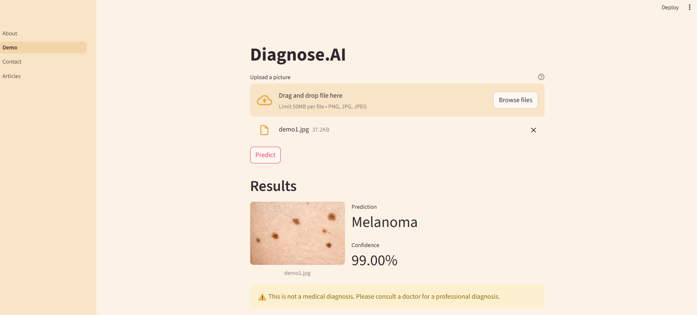

# Skin Cancer Detection

[Live Site](https://skin-cancer-check.streamlit.app/)

   

# Diagnose.AI 🧬🔬

Diagnose.AI is a deep learning powered web app for detecting 9 different types of skin lesions (including melanoma) from images. Built using TensorFlow and Streamlit.

## 🚀 Features
- Predict the type of skin lesion
- 9-class classification including:
  - Actinic keratosis
  - Basal cell carcinoma
  - Dermatofibroma
  - Melanoma
  - Nevus
  - Pigmented benign keratosis
  - Seborrheic keratosis
  - Squamous cell carcinoma
  - Vascular lesion

## 🖥️ Technologies Used
- TensorFlow / Keras
- Streamlit
- Python
- PIL

## 🧠 How It Works
1. Load trained CNN model (`model.h5`)
2. Preprocess uploaded image to 180x180
3. Predict probabilities using `softmax`
4. Show predicted class and confidence

## 🛠️ Setup Instructions

```bash
git clone https://github.com/vaibhav123-tech/skin-cancer-detection.git
cd skin-cancer-detection
pip install -r requirements.txt
streamlit run About.py
